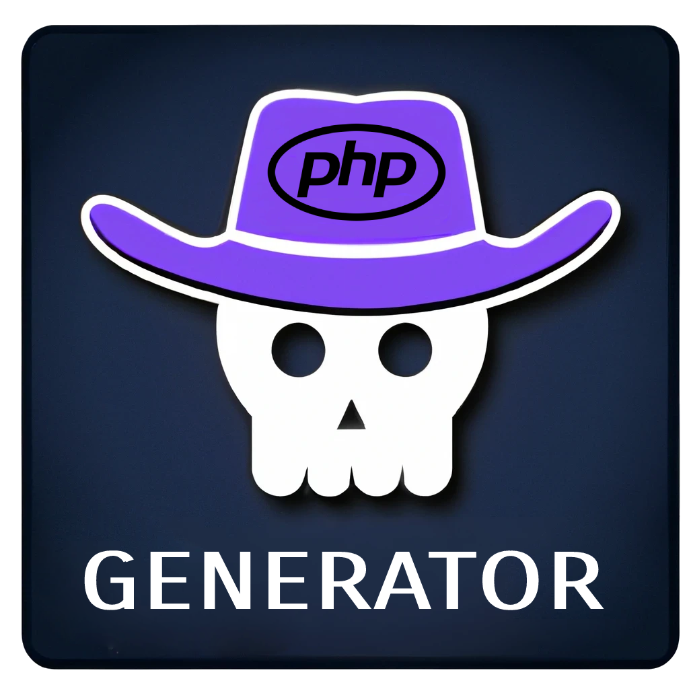

# php-skeleton-generator Extension for Visual Studio Code

Looking for an easy and quick way to generate PHP code skeletons? Check out our "PHP Skeleton Generator" extension! With just a few steps, you can create PHP classes, interfaces, traits, and enums with all the properties and methods you need. Our assistant guides you through the process, asking you for the options you need and generating the code for you. Save time and effort when creating your PHP projects with "PHP Skeleton Generator"!

## Features

- Run `php-skeleton-generate` command from the command palette to generate a skeleton for a PHP files 
    - Class
    - Interface
    - Enum
    - Trait

## Usage

1. Press `Ctrl+Shift+P` to open the command palette
2. Type `php-skeleton-generate` and press Enter
3. Chose a type of skeleton
3. Enter the name of your file and press Enter
4. Use the wizard to enrich your skeleton
5. The skeleton for the PHP class will be generated

### New Class

### New Interface

### New Enum

### New Trait

## Planned Features

- add psr4 support for autoload-dev
- compatibility with other PHP versions

## Requirements

- [Visual Studio Code](https://code.visualstudio.com/)
- [PHP 8](https://www.php.net/releases/8.0)

## Credits

- [Adrián García](https://github.com/adrigar94)

## License

This extension is licensed under the [MIT License](LICENSE).

**Enjoy!**
